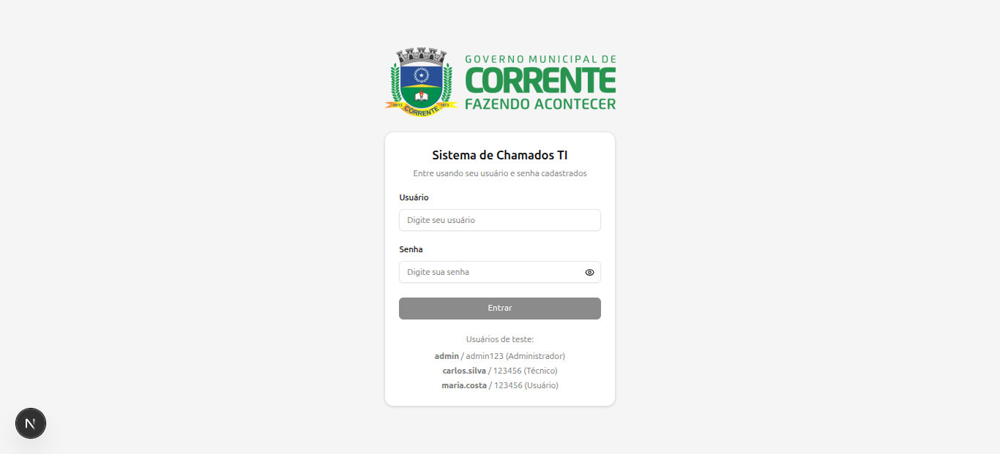
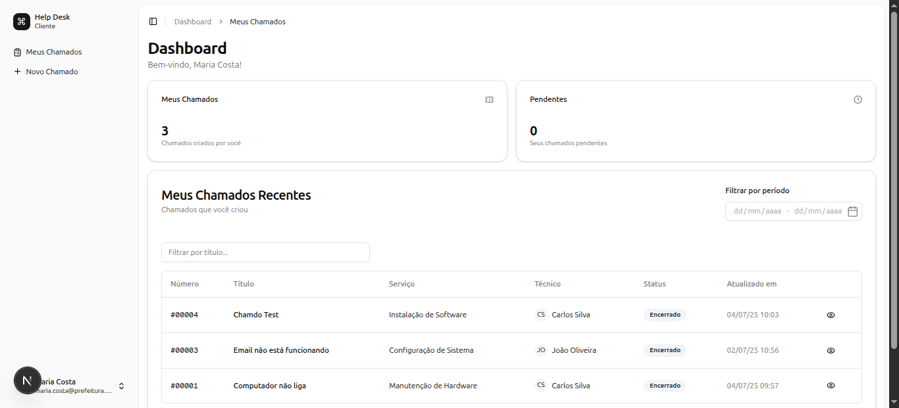
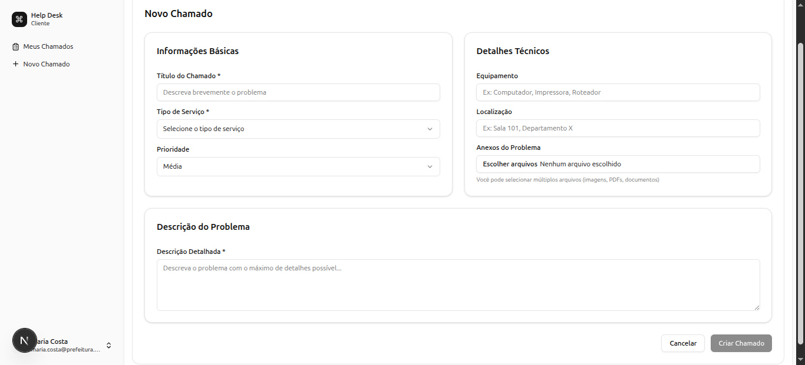
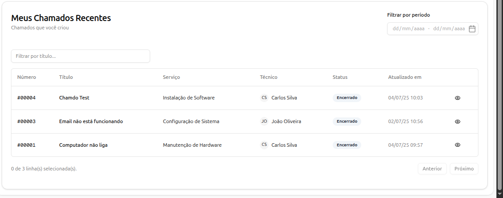
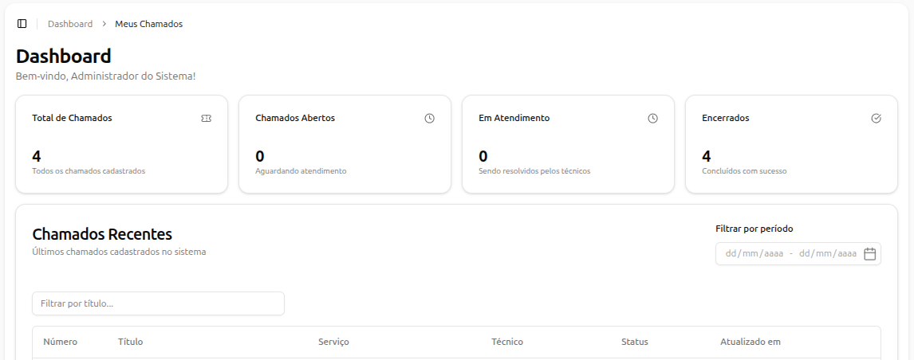

<!-- Improved compatibility of back to top link: See: https://github.com/othneildrew/Best-README-Template/pull/73 -->
<a name="top"></a>

<!-- PROJECT SHIELDS -->
[![Contributors][contributors-shield]][contributors-url]
[![Forks][forks-shield]][forks-url]
[![Stargazers][stars-shield]][stars-url]
[![Issues][issues-shield]][issues-url]
[![MIT License][license-shield]][license-url]
[![LinkedIn][linkedin-shield]][linkedin-url]

<!-- PROJECT LOGO -->
<br/>
<h3 align="center">Sistema de Chamados TI</h3>

  <p align="center">
    Sistema completo para gerenciamento de chamados de suporte técnico com frontend em Next.js e backend em Django REST Framework
    <br/>
    <br />
    <a href="https://github.com/HeitorLouzeiro/sistema-chamados-ti/issues">Reportar Bug</a>
    ·
    <a href="https://github.com/HeitorLouzeiro/sistema-chamados-ti/issues">Solicitar Feature</a>
  </p>
</div>


<!-- TABLE OF CONTENTS -->
<details>
  <summary>Table of Contents</summary>
  <ol>
    <li>
      <a href="#about-the-project">Sobre o Projeto</a>
      <ul>
        <li><a href="#built-with">Tecnologias Utilizadas</a></li>
        <li><a href="#features">Funcionalidades</a></li>
      </ul>
    </li>
    <li><a href="#usage">Demonstração</a></li>
    <li>
      <a href="#getting-started">Como Começar</a>
      <ul>
        <li><a href="#prerequisites">Pré-requisitos</a></li>
        <li><a href="#installation-docker">Instalação com Docker (Recomendado)</a></li>
        <li><a href="#installation-local">Instalação Local</a></li>
      </ul>
    </li>
    <li><a href="#api-endpoints">Endpoints da API</a></li>
    <li><a href="#roadmap">Roadmap</a></li>
    <li><a href="#contributing">Contribuindo</a></li>
    <li><a href="#collaborators">Colaboradores</a></li>
    <li><a href="#license">Licença</a></li>
    <li><a href="#contact">Contato</a></li>
  </ol>
</details>


<!-- ABOUT THE PROJECT -->
## Sobre o Projeto

O Sistema de Chamados TI é uma aplicação completa para gerenciamento de tickets de suporte técnico, desenvolvida com arquitetura moderna separando frontend e backend. O sistema permite que usuários abram chamados, técnicos gerenciem atendimentos e administradores tenham controle total sobre o fluxo de trabalho.

### 🎯 Principais Características:
- **Dashboard intuitivo** com estatísticas em tempo real.
- **Sistema de autenticação JWT** com diferentes níveis de acesso.
- **Upload de anexos** para documentar problemas.
- **Histórico completo** de todas as alterações.
- **API RESTful** documentada com Swagger.
- **Interface responsiva** para desktop e mobile.

<p align="right">(<a href="#top">back to top</a>)</p>

### Tecnologias Utilizadas

**Backend:**
* [![Python][Python]][Python-url]
* [![Django][Django]][Django-url]
* [![DRF][DRF]][DRF-url]
* [![PostgreSQL][PostgreSQL]][PostgreSQL-url]
* [![JWT][JWT]][JWT-url]

**Frontend:**
* [![Next.js][Next.js]][Next-url]
* [![TypeScript][TypeScript]][TypeScript-url]
* [![React][React.js]][React-url]
* [![TailwindCSS][TailwindCSS]][Tailwind-url]

**DevOps:**
* [![Docker][Docker]][Docker-url]
* [![Docker Compose][DockerCompose]][DockerCompose-url]

<p align="right">(<a href="#top">back to top</a>)</p>

### Funcionalidades

#### 👤 Para Usuários:
- ✅ Criar e acompanhar chamados
- ✅ Upload de arquivos anexos
- ✅ Visualizar histórico de atendimentos
- ✅ Dashboard personalizado

#### 🔧 Para Técnicos:
- ✅ Visualizar todos os chamados abertos e atribuidos a ele.
- ✅ Atualizar status e adicionar comentários
- ✅ Gerenciar chamados atribuídos

#### 👨‍💼 Para Administradores:
- ✅ Controle total do sistema
- ✅ Relatórios e estatísticas
- ✅ Configurar tipos de serviço

<p align="right">(<a href="#top">back to top</a>)</p>

<!-- USAGE EXAMPLES -->
## Demonstração

### 🔐 Página de Login


### 🏠 Dashboard Principal


### 🎫 Criação de Chamados


### 📋 Listagem de Chamados



### 📊 Relatórios e Estatísticas



<p align="right">(<a href="#top">back to top</a>)</p>

### Pré-requisitos

**Opção 1 - Docker (Recomendado):**
* [Docker](https://www.docker.com/)
* [Docker Compose](https://docs.docker.com/compose/)

**Opção 2 - Desenvolvimento Local:**
* [Python 3.11+](https://www.python.org/)
* [Node.js 18+](https://nodejs.org/)
* [PostgreSQL](https://www.postgresql.org/) (opcional)

<!-- GETTING STARTED -->
## Como Começar

### Instalação com Docker (Recomendado)

1. Clone o repositório
   ```sh
   git clone https://github.com/HeitorLouzeiro/sistema-chamados-ti.git
   ```
2. Acesse a pasta do projeto
   ```sh
   cd sistema-chamados-ti
   ```
3. Construa os containers
   ```sh
   docker compose build
   ```
4. Inicie os serviços
   ```sh
   docker compose up -d
   ```
5. Execute as migrações
   ```sh
   docker compose exec backend python manage.py migrate
   ```
6. Crie dados de usuarios para test.
   ```sh
   docker compose exec backend python manage.py criar_dados_exemplo
   ```

**🌐 Acesse a aplicação:**
- Frontend: http://localhost:3000
- Backend API: http://localhost:8000/api
- Admin Django: http://localhost:8000/admin
- Documentação API: http://localhost:8000/api/docs/

**📖 Para mais detalhes sobre Docker, consulte: [DOCKER.md](DOCKER.md)**

### Instalação Local

<details>
<summary>Clique para expandir as instruções de instalação local</summary>

#### Backend (Django)

1. Clone o repositório
   ```sh
   git clone https://github.com/HeitorLouzeiro/sistema-chamados-ti.git
   ```
2. Acesse a pasta da API
   ```sh
   cd sistema-chamados-ti/api
   ```
3. Crie um ambiente virtual
   ```sh
   python -m venv venv
   ```
4. Ative o ambiente virtual
   ```sh
   # Linux/Mac
   source venv/bin/activate
   
   # Windows
   venv\Scripts\activate
   ```
5. Instale as dependências
   ```sh
   pip install -r requirements.txt
   ```
6. Configure as variáveis de ambiente
   ```sh
   cp .env.example .env
   # Edite o arquivo .env com suas configurações
   ```
7. Execute as migrações
   ```sh
   python manage.py migrate
   ```
8. Crie um superusuário
   ```sh
   python manage.py criar_dados_exemplo
   ```
9. Inicie o servidor
   ```sh
   python manage.py runserver
   ```

#### Frontend (Next.js)

1. Acesse a pasta do frontend
   ```sh
   cd sistema-chamados-ti/core
   ```
2. Instale as dependências
   ```sh
   npm install
   ```
3. Configure as variáveis de ambiente
   ```sh
   cp .env.example .env
   # Configure NEXT_PUBLIC_API_URL=http://localhost:8000/api
   ```
4. Inicie o servidor de desenvolvimento
   ```sh
   npm run dev
   ```

</details>

<p align="right">(<a href="#top">back to top</a>)</p>


## Endpoints da API

### Autenticação
- `POST /api/usuarios/login/` - Login do usuário
- `POST /api/usuarios/logout/` - Logout do usuário
- `POST /api/usuarios/token/refresh/` - Renovar token JWT

### Chamados
- `GET /api/chamados/` - Listar chamados
- `POST /api/chamados/` - Criar novo chamado
- `GET /api/chamados/{id}/` - Detalhar chamado específico
- `PATCH /api/chamados/{id}/` - Atualizar chamado
- `PATCH /api/chamados/{id}/status/` - Atualizar status do chamado
- `GET /api/chamados/meus-chamados/` - Chamados do usuário logado
- `GET /api/chamados/chamados-tecnico/` - Chamados atribuídos ao técnico

### Usuários
- `GET /api/usuarios/` - Listar usuários
- `POST /api/usuarios/` - Criar usuário
- `GET /api/usuarios/me/` - Dados do usuário logado

**📚 Documentação completa disponível em:** http://localhost:8000/api/docs/

<p align="right">(<a href="#top">back to top</a>)</p>


<!-- ROADMAP -->
## Roadmap

- [x] Sistema de autenticação JWT
- [x] CRUD completo de chamados
- [x] Upload de anexos
- [x] Sistema de status e prioridades
- [x] Dashboard com estatísticas
- [x] API RESTful documentada
- [x] Interface responsiva
- [x] Dockerização completa

Veja as [issues abertas](https://github.com/HeitorLouzeiro/sistema-chamados-ti/issues) para uma lista completa de recursos propostos e problemas conhecidos.

<p align="right">(<a href="#top">back to top</a>)</p>

<!-- CONTRIBUTING -->
## Contribuindo

Contribuições são o que fazem a comunidade open source um lugar incrível para aprender, inspirar e criar. Qualquer contribuição que você fizer será **muito apreciada**.

Se você tem uma sugestão que tornaria este projeto melhor, por favor faça um fork do repositório e crie um pull request. Você também pode simplesmente abrir uma issue com a tag "enhancement".
Não esqueça de dar uma estrela ao projeto! Obrigado novamente!

1. Faça um Fork do Projeto
2. Crie sua Feature Branch (`git checkout -b feature/NovaFuncionalidade`)
3. Commit suas mudanças (`git commit -m 'Add: Nova funcionalidade incrível'`)
4. Push para a Branch (`git push origin feature/NovaFuncionalidade`)
5. Abra um Pull Request

<p align="right">(<a href="#top">back to top</a>)</p>

## Colaboradores

Agradecemos às seguintes pessoas que contribuíram para este projeto:

<table>
  <tr>
    <td align="center">
      <a href="#">
        <br>
        <sub>
          <b>Heitor Louzeiro</b>
        </sub>
      </a>
    </td>
  </tr>
</table>

<p align="right">(<a href="#top">back to top</a>)</p>


<!-- LICENSE -->
## Licença

Distribuído sob a Licença MIT. Veja [LICENSE](LICENSE) para mais informações.

<p align="right">(<a href="#top">back to top</a>)</p>


<!-- CONTACT -->
## Contato

<div align='center'>  
  <a href="https://www.instagram.com/heitorlouzeiro/" target="_blank">
    
  </a> 
  <a href = "mailto:heitorlouzeirodev@gmail.com">
        
  </a>
  <a href="https://www.linkedin.com/in/heitor-louzeiro/" target="_blank">
    
  </a> 
</div>

Project Link: [https://github.com/HeitorLouzeiro/sistema-chamados-ti](https://github.com/HeitorLouzeiro/sistema-chamados-ti)

<p align="right">(<a href="#top">back to top</a>)</p>


<!-- MARKDOWN LINKS & IMAGES -->
[contributors-shield]: https://img.shields.io/github/contributors/HeitorLouzeiro/sistema-chamados-ti.svg?style=for-the-badge
[contributors-url]: https://github.com/HeitorLouzeiro/sistema-chamados-ti/graphs/contributors
[forks-shield]: https://img.shields.io/github/forks/HeitorLouzeiro/sistema-chamados-ti.svg?style=for-the-badge
[forks-url]: https://github.com/HeitorLouzeiro/sistema-chamados-ti/network/members
[stars-shield]: https://img.shields.io/github/stars/HeitorLouzeiro/sistema-chamados-ti.svg?style=for-the-badge
[stars-url]: https://github.com/HeitorLouzeiro/sistema-chamados-ti/stargazers
[issues-shield]: https://img.shields.io/github/issues/HeitorLouzeiro/sistema-chamados-ti.svg?style=for-the-badge
[issues-url]: https://github.com/HeitorLouzeiro/sistema-chamados-ti/issues
[license-shield]: https://img.shields.io/github/license/HeitorLouzeiro/sistema-chamados-ti.svg?style=for-the-badge
[license-url]: https://github.com/HeitorLouzeiro/sistema-chamados-ti/blob/master/license
[linkedin-shield]: https://img.shields.io/badge/-LinkedIn-black.svg?style=for-the-badge&logo=linkedin&colorB=555
[linkedin-url]: https://linkedin.com/in/heitor-louzeiro

[Python]: https://img.shields.io/badge/Python-14354C?style=for-the-badge&logo=python&logoColor=white
[Python-url]: https://www.python.org/

[Django]: https://img.shields.io/badge/Django-092E20?style=for-the-badge&logo=django&logoColor=white
[Django-url]: https://www.djangoproject.com/

[DRF]: https://img.shields.io/badge/DRF-ff1709?style=for-the-badge&logo=django&logoColor=white
[DRF-url]: https://www.django-rest-framework.org/

[PostgreSQL]: https://img.shields.io/badge/PostgreSQL-316192?style=for-the-badge&logo=postgresql&logoColor=white
[PostgreSQL-url]: https://www.postgresql.org/

[JWT]: https://img.shields.io/badge/JWT-black?style=for-the-badge&logo=JSON%20web%20tokens
[JWT-url]: https://jwt.io/

[Next.js]: https://img.shields.io/badge/Next.js-000000?style=for-the-badge&logo=next.js&logoColor=white
[Next-url]: https://nextjs.org/

[TypeScript]: https://img.shields.io/badge/TypeScript-007ACC?style=for-the-badge&logo=typescript&logoColor=white
[TypeScript-url]: https://www.typescriptlang.org/

[React.js]: https://img.shields.io/badge/React-20232A?style=for-the-badge&logo=react&logoColor=61DAFB
[React-url]: https://reactjs.org/

[TailwindCSS]: https://img.shields.io/badge/Tailwind_CSS-38B2AC?style=for-the-badge&logo=tailwind-css&logoColor=white
[Tailwind-url]: https://tailwindcss.com/

[Docker]: https://img.shields.io/badge/Docker-2496ED?style=for-the-badge&logo=docker&logoColor=white
[Docker-url]: https://www.docker.com/

[DockerCompose]: https://img.shields.io/badge/Docker_Compose-2496ED?style=for-the-badge&logo=docker&logoColor=white
[DockerCompose-url]: https://docs.docker.com/compose/
